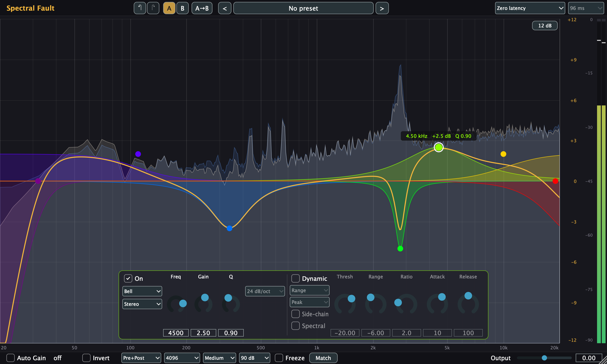
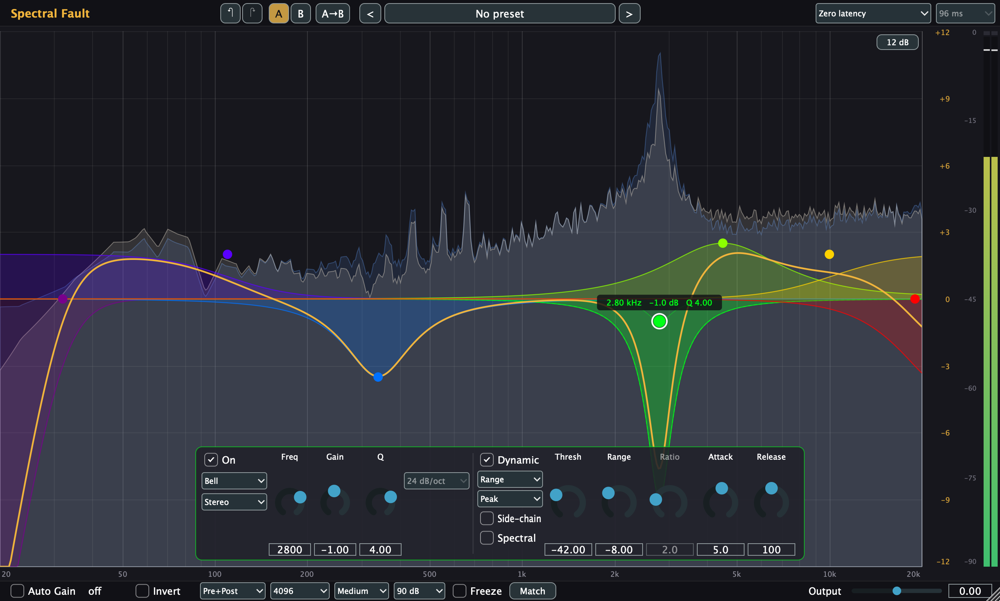
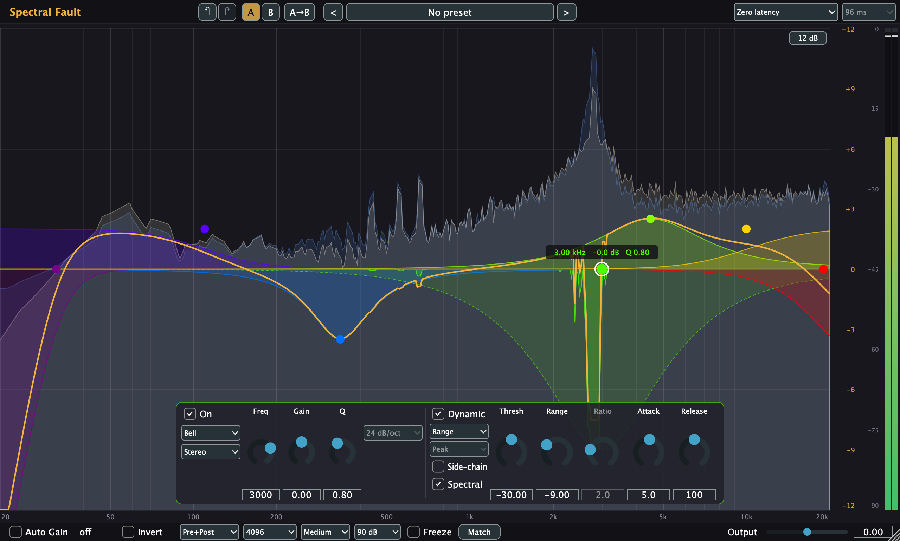
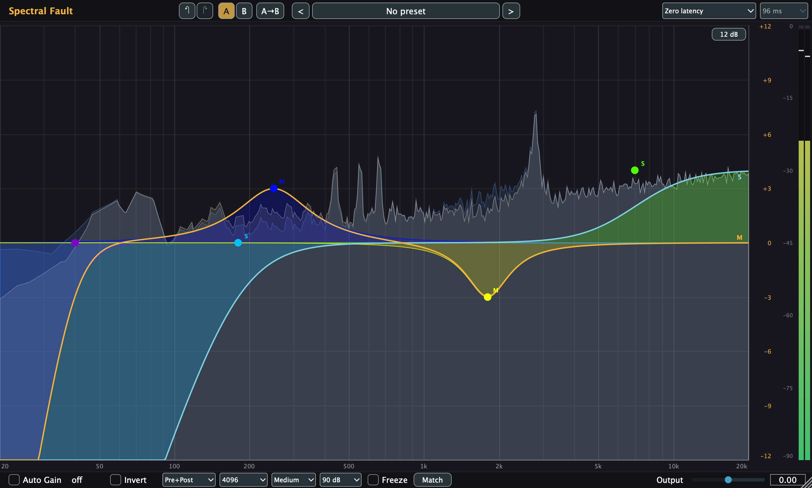
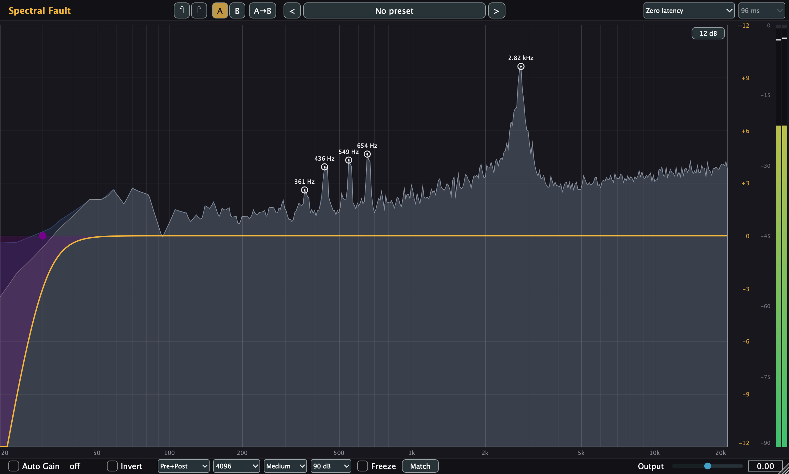
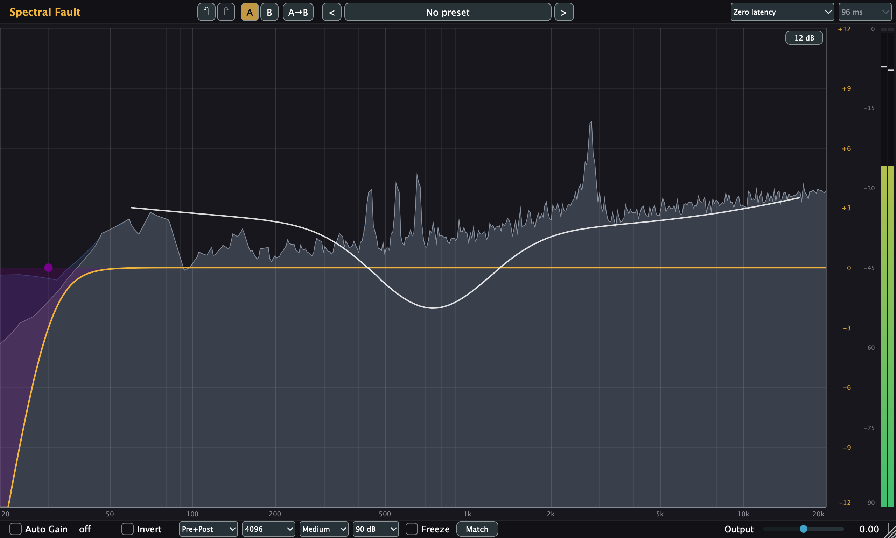
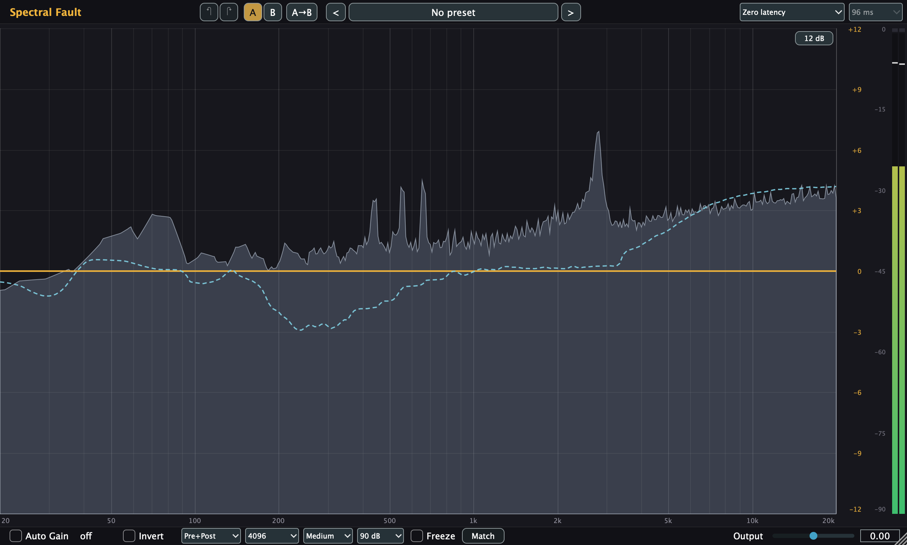

<div align="center">

# Spectral Fault

**A 16-band parametric and dynamic equalizer for macOS, by Catastrophic Audio**

[](LICENSE)


[User guide](https://catastrophiccoder.github.io/eq/) ·
[Features](#features) ·
[Under the hood](#under-the-hood) ·
[Building](#building-from-source) ·
[Development](docs/DEVELOPMENT.md)



</div>

Spectral Fault is an open-source equalizer plugin with analog-matched filters, dynamic bands with side-chain,
per-band stereo processing, a linear-phase mode and tools that turn a spectrum, a drawn curve or a reference track
into bands. It is a learning project written from published papers, with every filter checked numerically against
its analog prototype.

## Features

### Filters
- **16 bands**, each free, active or bypassed, with ten shapes: Bell, Low/High Shelf, Low/High Cut, Notch,
  Band Pass, Tilt Shelf, Flat Tilt and All Pass.
- **Cuts from 6 to 96 dB/oct** in 6 dB steps, plus a 192 dB/oct **Brickwall**.
- **Analog-matched response**: bells and shelves stay close to their analog shape right up to Nyquist, without the
  cramping of textbook digital designs.
- **Click-free editing**: parameters glide, and type, slope or bypass changes crossfade.

### Dynamics
- **Dynamic bands** (Bell and shelves): threshold, *range* or *ratio* law, attack, release, Peak or RMS detection.
- **Frequency-aware detection**: each band listens to its own region of the spectrum.
- **External side-chain**: let another track drive a band, for ducking or de-masking.
- **Spectral dynamics**: switch a dynamic band to *Spectral* and it acts per frequency slice, pulling down only
  the resonances or harsh spots that cross the threshold instead of the whole band.

### Stereo
- **Per-band channel mode**: Stereo, Left, Right, Mid or Side, freely mixed in one chain.
- **Split curve display**: L/R or M/S sums shown when bands act on different channels.

<p align="center">  </p>

### Phase
- **Zero latency** (minimum phase) or **Linear phase** with three filter lengths (about 96 / 181 / 352 ms of
  latency at 48 kHz), reported to the host for automatic delay compensation.

### Analysis and tools
- **Real-time analyzer**: input and output spectra, with adjustable resolution, speed, range and freeze, and a stereo output meter.
- **Peak pick**: rings mark the most prominent peaks; drag one to create a band tuned to that peak.
- **EQ Sketch**: Option-drag a curve over the display and it becomes bells, shelves and cuts.
- **EQ Match**: learn a reference track (side-chain or capture) and your own, preview the difference and fit it into bands.

<p align="center">  </p>

### Workflow
- **Factory and user presets**, **A/B comparison** (both slots saved with the project), **undo/redo** of your edits.
- **Auto Gain**: loudness compensation computed from the curve, K-weighted.
- **Interaction**: drag nodes, wheel or pinch for Q, multi-select, right-click menus, double-click to add a band.


## Under the hood

| Area | What it does | Source |
|---|---|---|
| Filter design | Matched second-order bells, band passes and cuts; matched two-pole shelves; matched one-pole tilt | M. Vicanek, *Matched Second Order Digital Filters* (2016); *Matched Two-Pole Digital Shelving Filters* (2024/25); *Matched One-Pole Digital Shelving Filters* (2019) |
| Real-time safety | The audio thread never allocates, locks or does file I/O; UI data flows through lock-free SPSC FIFOs; heavy work runs on background threads | Verified by an allocation-counting test |
| Spectral dynamics | Short-time FFT (2048-point frames, 75 % overlap, square-root Hann analysis and synthesis for exact reconstruction), a follower and gain law per frequency slice, weighted by the band's region | |
| Linear phase | Frequency-sampled zero-phase 2×2 stereo matrix, 4-term Blackman-Harris window, own uniformly partitioned overlap-save convolution that keeps its input history across filter changes | F. Harris, *On the Use of Windows…* (1978); F. Wefers, *Partitioned Convolution Algorithms for Real-Time Auralization* (2015) |
| Stereo model | Every band as a 2×2 transfer matrix, so L/R and M/S bands combine exactly (display, Auto Gain, linear phase) | |
| Auto Gain | Pink-noise power ratio of the curve, K-weighted | ITU-R BS.1770-5 |
| Curve fitting | EQ Sketch and EQ Match fit bells, shelves and cuts to a target with Levenberg-Marquardt least squares on the plugin's own designs | |
| Testing | ~290 Catch2 tests: responses against analog prototypes with stated bounds, stability sweeps, latency, no-allocation checks; pluginval (strictness 5) and auval | |

Built with [JUCE](https://juce.com) 9.0.2 (AGPLv3 option) and [Catch2](https://github.com/catchorg/Catch2), C++20, CMake.

## Getting started

There are no pre-built releases yet; build the plugin from source (below). The build installs the AU and VST3
into `~/Library/Audio/Plug-Ins/`, so they appear in your host after a rescan. The plugin shows up as
**Catastrophic Audio: Spectral Fault**.

New to it? The **[user guide](https://catastrophiccoder.github.io/eq/)** has an annotated tour of the interface and
walkthroughs for common jobs: cleaning up a vocal, taming resonances, dynamic de-essing, side-chain ducking,
mastering in linear phase, matching a reference and more.

## Building from source

Requirements: macOS with Xcode command-line tools, CMake 3.22+ and Ninja.

```bash
git clone --recurse-submodules https://github.com/CatastrophicCoder/eq.git
cd eq
cmake -B build -G Ninja -DCMAKE_BUILD_TYPE=Release
cmake --build build
```

The plugins are in `build/SpectralFault_artefacts/Release/` and are also installed automatically.
Running the tests, validating the plugin, the architecture and the project's conventions are described in
**[docs/DEVELOPMENT.md](docs/DEVELOPMENT.md)**.

## Status

All planned milestones (0–9) are done, including the deferred features: A/B, undo/redo, peak pick, EQ Sketch,
EQ Match and spectral dynamics. The plan and a detailed log are in [docs/PLAN.md](docs/PLAN.md) and [docs/PROGRESS.md](docs/PROGRESS.md).
The primary test host is Logic Pro (AU); the VST3 is checked with pluginval.

## How it is built

Spectral Fault is developed milestone by milestone, tests first, with the help of an AI coding assistant
(Claude Code). Every design decision is recorded with its alternatives in [docs/PROGRESS.md](docs/PROGRESS.md);
more in [docs/DEVELOPMENT.md](docs/DEVELOPMENT.md#how-this-project-is-developed).

## License

[GNU Affero General Public License v3.0](LICENSE). JUCE is used under its AGPLv3 option.
