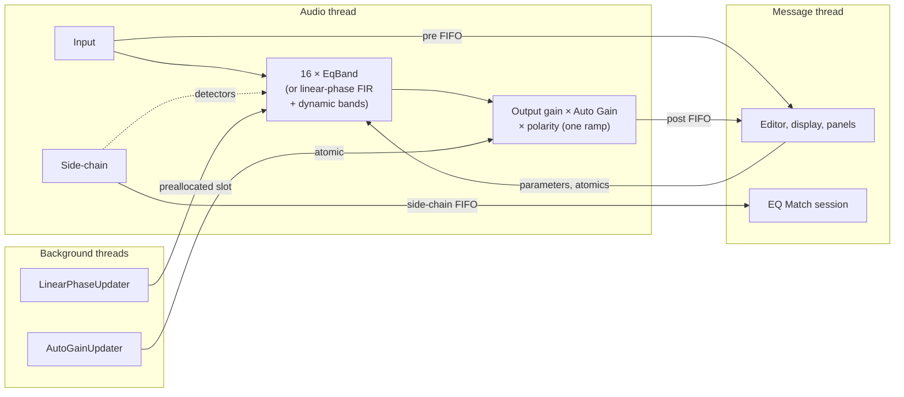

# Developing Spectral Fault

This guide covers building, testing and validating the plugin, how the code is organised, and the conventions the
project follows. For what the plugin does and how to use it, see the [README](../README.md) and the
[user guide](https://catastrophiccoder.github.io/eq/).

- [Prerequisites](#prerequisites)
- [Building](#building)
- [Testing](#testing)
- [Validating the plugin](#validating-the-plugin)
- [Troubleshooting](#troubleshooting)
- [Architecture](#architecture)
- [Source layout](#source-layout)
- [Saved state and compatibility](#saved-state-and-compatibility)
- [Testing approach](#testing-approach)
- [Conventions](#conventions)
- [How this project is developed](#how-this-project-is-developed)

## Prerequisites

| Tool | Notes |
|---|---|
| macOS with Xcode command-line tools | `xcode-select --install`; the project builds with Apple clang |
| CMake 3.22+ and Ninja | `brew install cmake ninja` |
| [pluginval](https://github.com/Tracktion/pluginval) | Plugin validation; the app bundle is enough (it does not need to be on `PATH`) |
| An IDE (optional) | CLion works out of the box (toolchain: Xcode clang, generator: Ninja) |

JUCE 9.0.2 and Catch2 are git submodules under `external/`, pinned to release tags. Clone with
`--recurse-submodules`, or run `git submodule update --init` in an existing clone. Nothing under `external/` is
edited.

## Building

```bash
# Debug (the everyday build; also installs the AU and VST3)
cmake -B build -G Ninja -DCMAKE_BUILD_TYPE=Debug
cmake --build build

# Release
cmake -B build/release -G Ninja -DCMAKE_BUILD_TYPE=Release
cmake --build build/release
```

| Target | What it is |
|---|---|
| `SpectralFault_AU`, `SpectralFault_VST3`, `SpectralFault_Standalone` | The plugin formats (all built by default) |
| `SpectralFault` | The shared code library the formats and tests link |
| `SpectralFaultTests` | The Catch2 test binary |

Artefacts land in `build/SpectralFault_artefacts/<Config>/`. `COPY_PLUGIN_AFTER_BUILD` is on, so **every build of
the plugin targets installs the AU and VST3 into `~/Library/Audio/Plug-Ins/`**. To measure Release performance
without replacing the installed Debug plugin, build only the tests in the Release tree:
`cmake --build build/release --target SpectralFaultTests`.

Plugin identity (never change the codes: hosts use them to find the plugin in saved projects):

| | |
|---|---|
| Product / company | Spectral Fault / Catastrophic Audio |
| Manufacturer code / plugin code | `Ctcd` / `Peq1` (AU type `aufx`) |
| Bundle ID | `com.catastrophicaudio.spectralfault` |

## Testing

```bash
ctest --test-dir build --output-on-failure -j8      # everything (about 290 tests)
build/tests/SpectralFaultTests "[linearphase]"      # one area, by tag
build/tests/SpectralFaultTests "A flat EQ*"         # by name (wildcards)
```

Catch2 splits test-name filters at commas; for names containing a comma, use a wildcard or a tag.

Hidden test cases (tags starting with `.`) only run when asked for:

| Command | Output |
|---|---|
| `EQ_SNAPSHOT_DIR=build/snapshots build/tests/SpectralFaultTests "[.snapshot]"` | PNGs of the editor at three sizes, for layout checks |
| `EQ_SCREENSHOT_DIR=docs/images build/tests/SpectralFaultTests "[.screenshots]"` | The documentation screenshots (README, user guide), rendered at 2× |
| `build/tests/SpectralFaultTests "[.diag]"` | Diagnostic tables, e.g. linear-phase accuracy for every shape and length |

CPU checks print their timings (`-s` shows them for passing tests), for example
`build/release/tests/SpectralFaultTests "[cpu]" -s`.

## Validating the plugin

```bash
/Applications/pluginval.app/Contents/MacOS/pluginval --strictness-level 5 \
    --validate "build/SpectralFault_artefacts/Debug/VST3/Spectral Fault.vst3"
/Applications/pluginval.app/Contents/MacOS/pluginval --strictness-level 5 \
    --validate "$HOME/Library/Audio/Plug-Ins/Components/Spectral Fault.component"
auval -v aufx Peq1 Ctcd
```

Every change is expected to pass all tests, pluginval at strictness 5 for both formats, and auval.

## Troubleshooting

| Symptom | Cause and fix |
|---|---|
| A new feature is missing in Logic after a rebuild | Logic keeps a plugin's code loaded until it quits. Quit Logic (⌘Q) and reopen the project. |
| The AU is missing from `auval -a` after a fresh build | Restart the AU registry: `killall -9 AudioComponentRegistrar`, then rescan. Not needed routinely (it slows validation). |
| Two plugins with the same codes | An old bundle with the same codes is still installed; remove it from `~/Library/Audio/Plug-Ins/`. |
| A Catch2 name filter matches nothing | The name contains a comma; use a wildcard or a tag. |

## Architecture



Threading rules, enforced in review and by tests:

- **Audio thread** (`processBlock` and everything it calls): no allocation, no locks or waiting, no file I/O or
  logging, and no FFT work beyond the convolution itself. `RealtimeAllocationTest` counts allocations on the audio
  thread with a replaced global `operator new`.
- **UI data** (analyzer, meter, EQ Match learning) leaves the audio thread through single-producer/single-consumer
  FIFOs (`AnalyzerFifo`, over `juce::AbstractFifo`), allocated once in the processor's constructor and fed only
  while needed.
- **Heavy work** runs on background threads: Auto Gain (`AutoGainUpdater`) and linear-phase filter design
  (`LinearPhaseUpdater`, which hands filters to the engine through a preallocated slot).
- **Every user-facing parameter** is smoothed or interpolated per sub-block; discrete changes (type, slope, bypass,
  dynamics on/off) crossfade over about 20 ms.

Key pieces:

| Component | Role |
|---|---|
| `EqBand` | One band: two filter slots for crossfades, smoothing, channel routing (Stereo/L/R/M/S), and the dynamic path (detector filter, `LevelDetector`, gain law, coefficients every 16 samples) |
| `BandDesign` | Settings → biquad sections, dispatching to the matched designs |
| `StereoTransfer` | The chain as a 2×2 complex matrix per frequency; used by Auto Gain, the display and the linear-phase designer |
| `LinearPhaseDesigner` / `LinearPhaseEngine` | Curve → symmetric FIRs; uniformly partitioned overlap-save convolution (512-sample partitions) that keeps its input spectra when the filter changes |
| `ResponseDisplay` | The interactive display: curves, analyzer, nodes, peak pick, EQ Sketch, match preview |
| `CurveFitter` | Levenberg-Marquardt fit of bells, shelves and cuts to a target curve (EQ Sketch, EQ Match) |
| `UndoHistory`, `AbComparison`, `SettingSnapshot` | Undo/redo of user edits, A/B slots, snapshots of the setting |
| `PresetManager` | Factory presets (compiled in) and user presets (XML files in `~/Library/Audio/Presets/Catastrophic Audio/Spectral Fault/`) |

## Source layout

```
src/
  PluginProcessor.*        Audio processor: buses (main + optional side-chain), state, phase modes
  PluginEditor.*           Editor: layout, timer-driven refresh, EQ Match window
  Parameters.*             Parameter layout (16 × 16 band parameters + output) and conversions
  AutoGainUpdater.*        Background Auto Gain
  LinearPhaseUpdater.*     Background linear-phase filter design
  dsp/                     Filter designs, EqBand, dynamics, stereo model, linear phase, analysis, curve fitting
  ui/                      Display, panels, bars, analyzer view, meter, peak pick, EQ Match UI
  presets/                 Presets, A/B, undo, setting snapshots
tests/                     Catch2 tests; DesignTestGrid.h holds the shared response grid and checker
docs/                      PLAN.md, PROGRESS.md, this guide, images/, guide/ (the user guide web page)
tools/                     Helper scripts (documentation link check)
external/                  JUCE and Catch2 submodules (not edited)
```

One class per file; DSP in `src/dsp/`, UI in `src/ui/`.

## Saved state and compatibility

The saved state is XML with a `stateVersion` attribute. Newer versions load everything older; a state from a newer
version is ignored rather than misread.

| Version | Added | Older states load as |
|---|---|---|
| 1 | Milestone 1: one bell | – |
| 2 | Full band set (M2) | Band 1 as a bell, enabled |
| 3 | Hidden in-use flag per band (M4) | In use = enabled |
| 4 | Phase mode and length (M8) | Zero latency |
| 5 | A/B slots, as an `ABComparison` element beside the parameters (M9a) | Both slots equal |
| 6 | Learned EQ Match spectra, as an `EQMatch` element (M9e) | Nothing learned |

Parameter IDs carry the band number (`band1_freq` … `band16_sidechain`) and a JUCE version hint per milestone;
IDs and hints never change once released. Preset files have their own `formatVersion` (currently 2).

## Testing approach

An equalizer is unusually testable: every filter has an analytic target. Tests come first, then the code.

- **Responses**: the measured response (an impulse through the processing code) must match the digital design
  within 0.1 dB, and the design must stay within a stated bound of the analog prototype, on a grid of
  frequencies, gains and Qs at 44.1, 48 and 96 kHz (192 kHz near Nyquist). Bounds are stated per shape with the
  worst measured case next to them, and are never raised silently (see `tests/DesignTestGrid.h` and the Decisions
  table in [PROGRESS.md](PROGRESS.md)).
- **Cuts**: attenuation one and two octaves out equals 6 dB/oct per order.
- **Stability**: a 20 Hz → 20 kHz sweep over one second produces no NaN, Inf or jumps above a threshold.
- **Linear phase**: reported latency equals the measured delay; the impulse response is symmetric; the magnitude
  nulls against Zero latency mode.
- **Real time**: no allocation in `processBlock`, including while filters are swapped.
- **UI**: controls attach to the right parameters, grey out correctly and fit at the smallest, default and
  largest window sizes; rendered snapshots are checked by eye.

## Conventions

- C++20, JUCE naming style (`camelCase` functions and variables, `PascalCase` classes).
- DSP is implemented from published papers and formulas, cited in the code; no code is copied from other
  projects. Derivations of our own are marked as such.
- No other companies' product names, logos or assets anywhere in the code, UI or documentation.
- No third-party dependencies beyond JUCE and Catch2.
- Small, focused commits: `M<n>: <what changed>` for milestone work (e.g. `M8: add linear-phase design tests`),
  `Docs: …` for documentation.

## How this project is developed

Spectral Fault is a learning project built with an AI coding assistant, Claude Code, under rules written in
[CLAUDE.md](../CLAUDE.md):

1. **Milestones** from [PLAN.md](PLAN.md) are taken one at a time, split into stages.
2. **Every design decision is the owner's**: the assistant lays out the options with their trade-offs, and the
   choice is recorded with the alternatives in the Decisions table of [PROGRESS.md](PROGRESS.md).
3. **A plan comes before any edit**: files, tests and commands, approved before work starts.
4. **Tests are written first** and committed before the implementation.
5. **Each step ends with** a build, all tests, pluginval and auval, a snapshot check for UI work, and a session
   log entry in PROGRESS.md.
6. **Listening tests are human**: the owner checks each milestone in Logic Pro before it is marked done; the
   assistant cannot hear audio, so everything it verifies is numerical.

To continue the work with Claude Code, start a session in the repository root and name the milestone or feature;
the assistant reads CLAUDE.md, PLAN.md and PROGRESS.md first.
