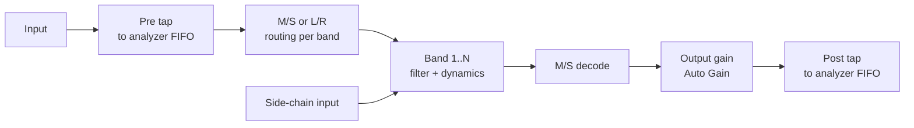

# Parametric EQ Plugin – Hobby Project Plan

Exported from the Claude Doc on 27 Sep 2026. Track progress in [PROGRESS.md](PROGRESS.md).

## The reference EQ

The reference for scope is a current commercial parametric equalizer with up to 24 bands, three phase modes, dynamic and spectral-dynamic EQ, per-band mid/side, surround up to 9.1.6, and a large interactive display with a real-time spectrum analyzer. Its features fall into four tiers of implementation difficulty; a hobby version can stop at any tier and still be a complete EQ.

| Tier | Reference EQ feature (from its product page) | What it takes to build |
| --- | --- | --- |
| 1 Core EQ | Up to 24 bands; shapes Bell, Notch, High/Low Shelf, High/Low Cut, Band Pass, Tilt Shelf, Flat Tilt, All Pass; slopes up to 96 dB/oct plus Brickwall for cuts; zero-latency mode; Auto Gain; phase invert | Biquad or state-variable filters, cascaded for steep slopes; parameter smoothing; one `AudioProcessorValueTreeState` per band |
| 2 Interactive display | Drag-and-drop EQ curve, multi-band selection, display ranges 3/6/12/30 dB, pre/post spectrum analyzer with freeze, output meter, piano-roll frequency grid, resizable UI | Magnitude-response computation per band, FFT analyzer fed lock-free from the audio thread, a custom JUCE `Component` with hit-testing and drag gestures |
| 3 Advanced DSP | Linear phase with adjustable latency, natural-phase mode, dynamic EQ (attack, release, side-chain filter, external trigger), per-band mid/side or left/right, Character modes (Gentle, Warm), Smart Parameter Interpolation | FIR design and FFT convolution, latency reporting, envelope followers driving band gain, M/S matrixing, saturation stages |
| 4 Workflow and research | Spectral dynamics (per-frequency triggering inside a band), EQ Match, EQ Sketch, Spectrum Grab, Instance List across plugin instances, surround/Atmos, MIDI Learn, undo/redo, A/B | STFT-domain processing, curve fitting from a drawn line or a target spectrum, inter-instance communication, multichannel bus layouts |

The page states outcomes ("highest possible sound quality", low CPU) but gives no filter topology, latency figures for linear phase, or description of how its natural-phase mode works; those are treated as unknown here.

## What a comparable EQ requires

An EQ has less non-linear DSP than an amp sim, but a much larger share of the work is in the user interface and in filter mathematics. Seven areas of knowledge are needed; the depth column is for a tier 1–3 hobby build.

| Area | What you need | Depth for a hobby build |
| --- | --- | --- |
| Real-time C++ | No allocation, locks or I/O on the audio thread; lock-free FIFOs to pass analyzer data to the UI; denormal handling | Essential from day one |
| JUCE plugin framework | `AudioProcessor`, `AudioProcessorValueTreeState` for many parameters (24 bands × ~8 parameters ≈ 200), state save/load, bus layouts for stereo and side-chain | Core |
| IIR filter design | Bilinear transform, biquad coefficient formulas for each shape, cascading sections for 12–96 dB/oct slopes, frequency warping near Nyquist | Core; tier 1 is mostly this |
| Filter modulation | Coefficient interpolation or topology choice so that fast knob moves and automation do not click or go unstable | Core; matters as soon as a band is draggable |
| FFT and FIR | Windowing, overlap-add, FFT-based analyzer; for linear phase, designing an FIR from a target magnitude and convolving with latency compensation | Tier 2 (analyzer) and tier 3 (linear phase) |
| Custom 2D UI | JUCE `Graphics` paths, log-frequency / dB coordinate mapping, hit-testing, mouse and trackpad gestures, 60 fps repaint without stalling the message thread | Large; typically the biggest single time sink |
| Audio measurement | Impulse and sweep tests, comparing measured response to the analytic curve, null tests between phase modes | Needed to know the filters are right |

Not needed for tiers 1–3: machine learning, circuit modelling, or reference hardware. A commercial JUCE licence is not needed while the project stays within JUCE's free tier or is released under AGPLv3 (see Risks).

## Milestones

The milestones follow the tiers: a working multi-band EQ with knobs first, then the interactive display, then advanced DSP. Each milestone ends with a plugin that loads in a DAW and does something useful. Effort assumes roughly 5–8 hours a week alongside work and studies.

| # | Milestone | Done when | Estimated effort |
| --- | --- | --- | --- |
| 0 | Toolchain | JUCE CMake example builds from CLion, loads as AU and standalone, git repo initialised | 1 weekend |
| 1 | One bell band | Frequency, gain and Q knobs on one peaking biquad; smoothed parameters; state save/load; measured response matches the analytic curve | 1–2 weeks |
| 2 | Full band set, tier 1 | 16 bands, all tier-1 shapes, cut slopes 12–96 dB/oct by cascading, per-band enable, output gain, Auto Gain | 3–5 weeks |
| 3 | Response curve display | Static log-frequency / dB graph drawing each band's curve and the sum; display range switch | 2–3 weeks |
| 4 | Interactive display | Drag nodes to set frequency/gain, scroll or pinch for Q, double-click to add a band, right-click menu for shape and slope, multi-select | 4–6 weeks |
| 5 | Spectrum analyzer | Pre/post FFT analyzer drawn under the curve, adjustable speed and resolution, freeze | 2–3 weeks |
| 6 | Per-band stereo | Each band set to Stereo, Left, Right, Mid or Side | 1–2 weeks |
| 6b | Presets (added 2026-09-28) | Factory presets for common instruments and vocals, built from cited public sources; user presets saved as files; preset browser in the top bar | 1–2 weeks |
| 7 | Dynamic EQ | Per-band threshold, ratio or range, attack, release; optional external side-chain input | 3–5 weeks |
| 8 | Linear phase mode | FIR generated from the summed magnitude response, FFT convolution, latency reported to the host, selectable latency | 4–6 weeks |
| 9 | Deferred (split 2026-09-29) | 9a A/B comparison, 9b undo/redo, 9c Spectrum Grab, 9d EQ Sketch, 9e EQ Match, 9f natural-phase-style mode (skipped: Zero latency is already near analog phase), 9g spectral dynamics (presets done in 6b; MIDI Learn dropped: hosts map controllers) | As interest dictates |

Milestones 6, 7 and 8 do not depend on each other and can be taken in any order after milestone 5. Milestone 4 is where UI work starts to dominate; milestones 7 and 8 are where DSP depth dominates.

## Toolchain setup (macOS, CLion, JUCE, C++)

The toolchain is the same as for any JUCE plugin on macOS. The latest JUCE release at the time of writing is [9.0.2](https://github.com/juce-framework/JUCE/releases/tag/9.0.2) (7 Sep 2026); its CMake support requires CMake 3.22 or newer.

Project generation has two options, with these trade-offs:

| Criterion | CMake (`juce_add_plugin`) | Projucer |
| --- | --- | --- |
| CLion integration | Native: CLion opens `CMakeLists.txt` directly | Projucer has a CLion exporter, but the `.jucer` file stays the source of truth |
| Adding third-party libraries | Standard CMake (`add_subdirectory`, `FetchContent`) | Paths entered in the Projucer GUI |
| CI and command-line builds | Straightforward | Requires regenerating projects first |
| Learning curve | Requires CMake knowledge | GUI-driven; most older JUCE tutorials use it |

Setup steps (CMake route):

1. Install Xcode and run `xcode-select --install`; the Apple SDKs and AU tooling are needed even when building from CLion.
2. `brew install cmake ninja`.
3. In CLion, set the toolchain to the Xcode clang and the generator to Ninja.
4. Add JUCE as a git submodule pinned to a release tag, or pull it with `FetchContent`.
5. `juce_add_plugin(...)` with `FORMATS AU VST3 Standalone`, linking `juce::juce_audio_utils` and `juce::juce_dsp`.
6. Build the Standalone target and run it; build AU and confirm it appears in a host (Logic, GarageBand, Reaper).
7. Validate with `auval` and [pluginval](https://github.com/Tracktion/pluginval).

Repository layout to start with:

```
eq/
  CMakeLists.txt
  external/JUCE/        (submodule, pinned)
  src/
    PluginProcessor.h/.cpp
    PluginEditor.h/.cpp
    dsp/                (Band, FilterDesign, Analyzer, LinearPhase, Dynamics)
    ui/                 (ResponseCurve, BandNode, AnalyzerView, LookAndFeel)
  tests/                (Catch2 or GoogleTest: coefficient and response tests)
  tools/                (Python scripts for plotting measured responses)
```

## Architecture and DSP design

The processor is a chain of identical band objects between an optional mid/side encoder and decoder, with analyzer taps before and after. All parameters live in one `AudioProcessorValueTreeState`; the UI reads parameters and analyzer data but never touches the audio buffers.



The analyzer FIFOs are single-producer/single-consumer (`juce::AbstractFifo`); the UI thread runs the FFT (`juce::dsp::FFT`, Hann window, log-frequency binning, time smoothing) on a 30–60 Hz timer.

### Filter topology

The choice of filter structure affects stability under modulation, accuracy near Nyquist and code complexity. Three documented options:

| Criterion | Direct-form biquad with RBJ cookbook coefficients | Topology-preserving / state-variable filter (Zavalishin, Simper) | Matched second-order designs (Vicanek, Orfanidis) |
| --- | --- | --- | --- |
| Reference material | Most widely published; `juce::dsp::IIR::Coefficients` implements it | Free papers and Cytomic technical notes; `juce::dsp::StateVariableTPTFilter` covers LP/HP/BP | Published papers with closed-form coefficients |
| Behaviour under fast parameter change | Can click or briefly misbehave unless coefficients are interpolated or changed per small sub-block | Designed to stay stable when cutoff and Q change every sample | Same structure as biquad, so same modulation considerations |
| Response near Nyquist ("cramping") | Bells and shelves narrow or distort above roughly 10 kHz at 44.1 kHz due to bilinear-transform warping | Same warping as bilinear designs | Designed to match the analog magnitude up to Nyquist |
| Implementation effort | Lowest | Moderate: shelves and bells built from SVF outputs | Moderate: more complex coefficient maths |

Oversampling is a fourth way to reduce cramping; it costs CPU and adds latency or filter phase shift of its own.

### Slopes, shapes and phase modes

- Steep cuts: cascade second-order (and one first-order for odd orders) Butterworth sections; 96 dB/oct is 16th order, i.e. 8 biquads. The Q of each section follows the Butterworth pole angles. The reference EQ's non-integer "continuous" slopes are not documented; crossfading or interpolating between adjacent orders is one approach.
- Tilt and Flat Tilt: a tilt shelf is a first- or second-order shelf pair; a flat tilt across the whole band can be approximated by several cascaded shelves or by an FIR in linear-phase mode.
- Response curve for the display: evaluate each band's transfer function H(e^jω) at around 512 log-spaced frequencies and multiply; recompute only when a parameter changes, not per frame.

| Phase mode | How it is built | Latency | Trade-off |
| --- | --- | --- | --- |
| Zero latency (minimum phase) | The IIR chain as above | 0 samples | Phase shift around each band's frequency |
| Linear phase | Compute the summed magnitude response, build a symmetric FIR by inverse FFT and windowing, run it with partitioned FFT convolution; regenerate the FIR on a background thread when parameters change | Half the FIR length, e.g. 2048 samples for a 4096-tap FIR (≈ 46 ms at 44.1 kHz); must be reported with `setLatencySamples` | Pre-ringing on transients at low frequencies; CPU and memory higher; parameter changes need a crossfade between FIRs |
| Natural-phase style | Not documented by the reference EQ's vendor; published approaches include matching the phase of the analog prototype rather than the bilinear one | Unknown | Research item, placed in milestone 9 |

### Dynamic EQ

Per band: a detector filter (a band-pass at the band's frequency, or an external side-chain) feeds an envelope follower with attack and release; the envelope sets the band's gain between its static value and a range limit. Gain changes each sample or each small sub-block (8–32 samples), which is where the filter-topology choice above matters.

### Threading rules

The audio thread never allocates, locks, or does FFT-based FIR design. Linear-phase FIRs are designed on a background thread and swapped in atomically; the analyzer's FFT runs on the UI thread.

## Testing and validation

An EQ is unusually testable: every filter has an analytic target response, so correctness can be asserted numerically rather than judged by ear.

- Coefficient tests: for each shape, compare computed biquad coefficients to values from a reference implementation (e.g. Python `scipy.signal` or the RBJ formulas worked by hand) within a small tolerance.
- Response tests: send an impulse through a band, FFT the output, and assert the gain at the centre frequency, at the shelf plateau and at ±1 octave matches the analytic curve within e.g. 0.1 dB. Repeat at 44.1, 48, 96 and 192 kHz, since cramping and warping depend on sample rate.
- Slope tests: for cut filters, measure attenuation one and two octaves past the cutoff and assert 12 n dB/oct for order 2n.
- Stability and modulation: sweep a band's frequency from 20 Hz to 20 kHz over one second with automation and check the output for NaN, infinity, and discontinuities above a threshold.
- Phase-mode checks: linear-phase output should null against the zero-latency output's magnitude (compared in the frequency domain) and show a symmetric impulse response; reported latency should equal the measured delay of an impulse.
- Display accuracy: the plotted curve at a set of frequencies should equal the measured response of the audio path.
- Plugin conformance: `pluginval` at strictness 5 and `auval` on each build; Address and Thread Sanitizer builds in CLion.
- External cross-check: a free measurement tool such as Plugin Doctor (DDMF) can show your plugin's magnitude and phase response next to any other EQ loaded in the same host.

Python scripts in `tools/` can read `.wav` files written by the tests and plot measured vs analytic curves with `numpy`, `scipy` and `matplotlib`.

## Learning resources and open-source references

Several open-source JUCE equalizers already implement most of tiers 1–3, and their READMEs cite the filter-design papers they rely on. They range from a small teaching example to a 24-band dynamic EQ.

| Resource | What it is | Use it for |
| --- | --- | --- |
| [Frequalizer](https://github.com/ffAudio/Frequalizer) (Daniel Walz) | Compact JUCE EQ built on the `juce::dsp` module with a response curve and analyzer | Milestones 1–5 at readable size |
| [ZL Equalizer](https://github.com/ZL-Audio/ZLEqualizer) | AGPLv3 JUCE dynamic EQ, 24 bands by default, built on the pamplejuce template; actively maintained (updated Sep 2026) | Milestones 4–8; its README lists references including Vicanek's matched filters, Redmon's cascading filters and Wishnick's time-varying filters |
| [ZL Spectrum Equalizer](https://github.com/ZL-Audio/ZLSpectrumEqualizer) | AGPLv3 dynamic spectrum EQ from the same author | Background for spectral-dynamics research (milestone 9) |
| [FreeEQ8](https://github.com/GareBear99/FreeEQ8) | Open-source JUCE/CMake 8-band EQ with linear phase, dynamic EQ, match EQ, M/S and analyzer; documents a 2048-sample linear-phase latency reported via `setLatencySamples` | Worked example of latency reporting and feature scope |
| Robert Bristow-Johnson, *Audio EQ Cookbook* (W3C note) | Standard biquad formulas for every common EQ shape | Milestones 1–2 |
| Vadim Zavalishin, *The Art of VA Filter Design* (free PDF, Native Instruments) and Andrew Simper's Cytomic technical papers | Topology-preserving and SVF filters, modulation-stable designs | Filter topology decision |
| Martin Vicanek, *Matched Second Order Digital Filters* (2016) | Closed-form filters matching analog response up to Nyquist | Cramping, milestone 2 onwards |
| Julius O. Smith, *Introduction to Digital Filters* and *Spectral Audio Signal Processing* (free online, CCRMA) | Filter theory, FFT, windowing, FIR design | Milestones 5 and 8 |
| [pamplejuce](https://github.com/sudara/pamplejuce) | JUCE + CMake + Catch2 + CI template | Milestone 0 |
| [pluginval](https://github.com/Tracktion/pluginval) | Plugin validator | Every milestone |
| The reference EQ's user manual | Describes each feature's behaviour from the user side | Feature specs for your own implementation |

Reading AGPLv3 code for ideas is unrestricted; copying it into your plugin makes your plugin AGPLv3 if distributed. Confirm each repository's licence on its own page before depending on it.

## Risks, licensing and open questions

The main project risk is that the interactive display (milestone 4) takes far longer than the DSP; the milestones are ordered so a knob-only EQ is already usable before that work starts.

| Risk | Effect | Mitigation |
| --- | --- | --- |
| UI effort underestimated | Motivation loss at milestone 4 | Ship milestone 2 with JUCE's default knobs first; build the curve display as a separate `Component` testable in isolation |
| Clicks or instability when dragging bands | Audible artefacts, unusable dynamic EQ | Decide filter topology before milestone 4; automated sweep test from milestone 2 |
| Cramping near Nyquist | High bells and shelves sound different at 44.1 vs 96 kHz | Measure at several sample rates from milestone 1; choose a mitigation from the topology table |
| Linear-phase latency or crossfade bugs | Misaligned mixes, zipper noise on parameter change | Test reported vs measured latency; crossfade between old and new FIR |
| ~200 parameters | Slow host automation lists, state-size and versioning issues | Parameter IDs that include the band index; a state version number from the first release |
| Time: work plus master's studies | Long gaps between sessions | Each milestone independently usable; short session notes in the repo |

Licensing facts to check before publishing anything:

- JUCE is dual-licensed under AGPLv3 and a commercial JUCE licence with a free tier below a revenue limit; read the current terms at juce.com.
- VST3 comes with its own SDK licence (bundled with JUCE); AU needs no separate licence; AAX requires an Avid developer agreement and PACE signing.
- Code copied from ZL Equalizer or other AGPLv3/GPLv3 projects carries that licence into your plugin if distributed; published papers and the RBJ cookbook formulas carry no such restriction.
- The reference EQ's product and company names are trademarks; a public release needs its own name and must not use those names. Decision 2026-09-28: the UI may follow the reference EQ's overall layout, with our own components, styling and colour values; no copied graphics or assets (see CLAUDE.md).

Open questions (tracked in `CLAUDE.md` until decided, then logged in `PROGRESS.md`):

- [x] Filter topology: matched second-order designs (Vicanek).
- [x] Project generation: CMake.
- [x] Target band count: 16.
- [x] After milestone 5: per-band stereo, then dynamic EQ, then linear phase.
- [x] Public open-source repo, AGPLv3.
- [x] Primary test host: Logic.
- [ ] Could any part (e.g. matched filters or linear-phase design) serve as coursework in the master's programme?
